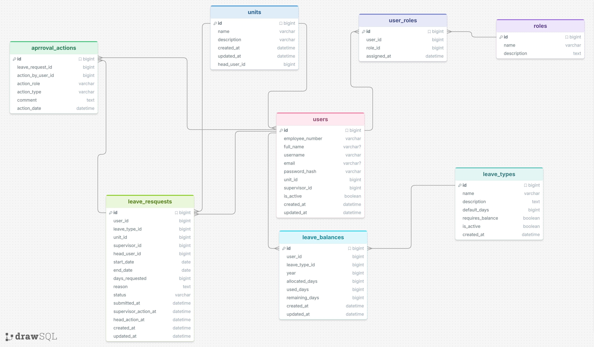
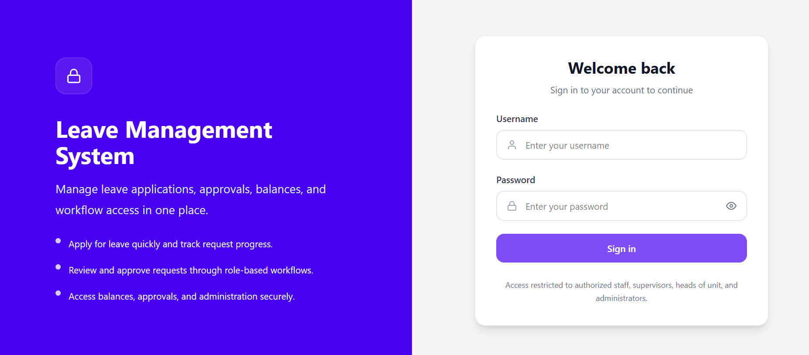
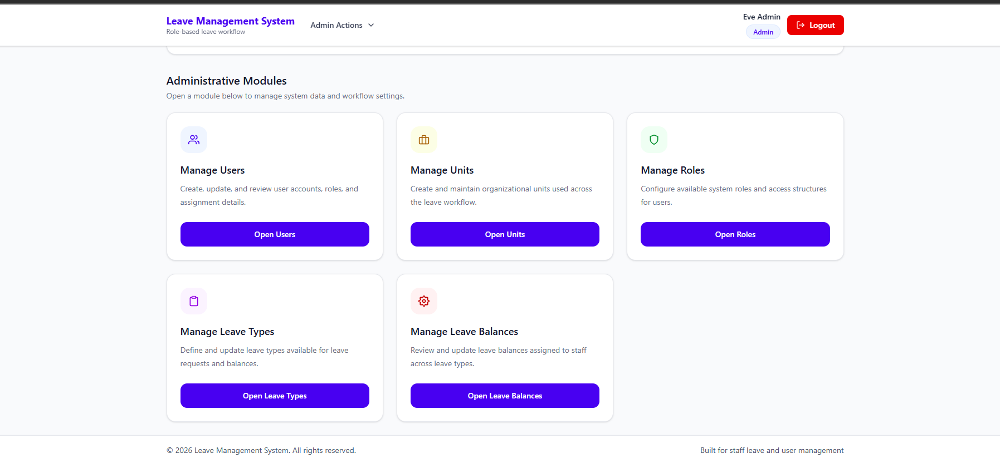
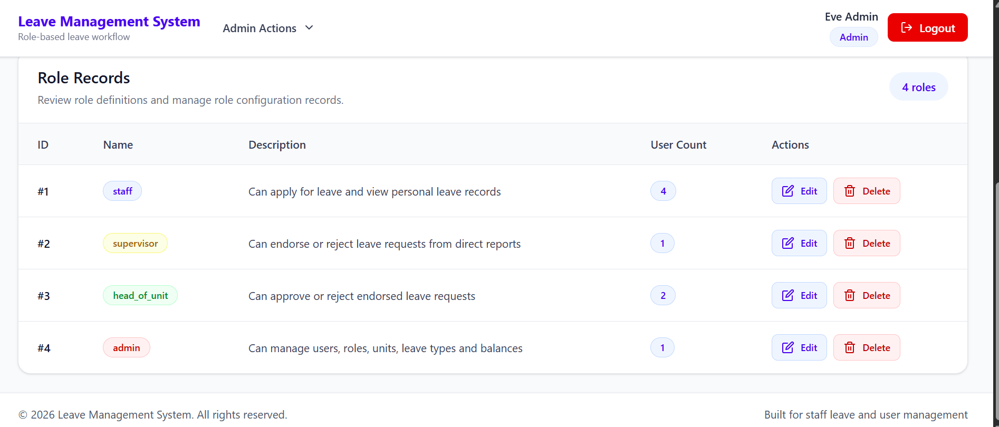
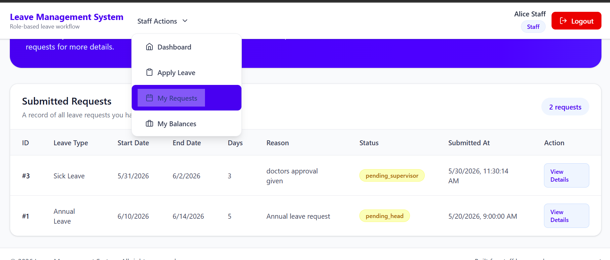
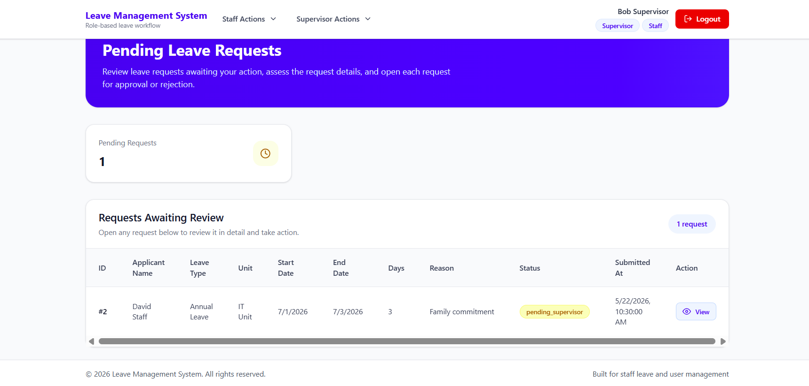
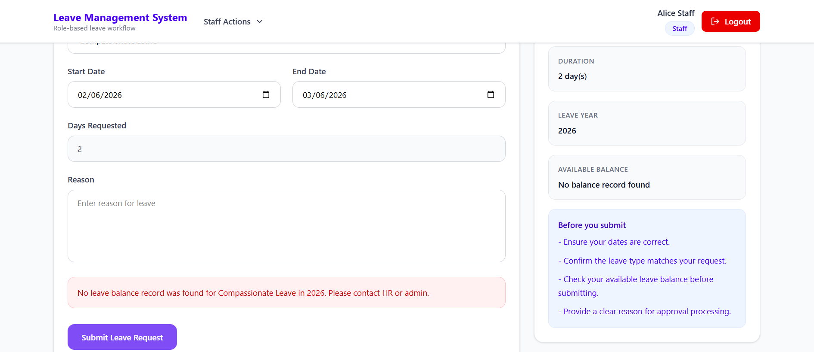

# Leave Management System

A full-stack Leave Management System built with **Flask (Python)** and **React**, designed to support role-based workflows for managing staff leave applications, approvals, and balance tracking.

---

## Live Demo

- **Frontend (React):**  
  https://leave-management-system-y0gy.onrender.com

- **Backend (Flask API):**  
  https://leave-management-backend-sm16.onrender.com

- **Sample Login Credentials**

### Admin
- Username: eve
- Password: Password123!

### Head of Unit
- Username: carol
- Password: Password123!

### Supervisor
- Username: bob
- Password: Password123!

### Staff
- Username: alice
- Password: Password123!

---

## Features

### Authentication & Authorization
- Secure login using JWT (access + refresh tokens)
- Role-based access control
- Automatic token refresh for expired access tokens
- Session persistence using localStorage

---

### Role-Based Workflows

The system supports multiple roles Staff. The system supports multiple roles: Admin, Head of the unit, supervisor, staff

### Staff
- Apply for leave
- View leave requests
- View leave balances
#### Supervisor
- Review and approve/reject leave requests

#### Head of Unit
- Final approval of leave requests

#### Admin
- Manage users, roles, and units
- Configure leave types
- Monitor and update leave balances

---


## Technologies Used

### Frontend
- React 
- React Router
- Axios
- Tailwind CSS
- React Toastify
- React Icons

### Backend
- Flask
- Flask-SQLAlchemy
- Flask-Migrate
- Flask-JWT-Extended
- Flask-CORS
- PostgreSQL (psycopg2)

---

## Local Setup Instructions

### Backend Setup (Flask)

### 1. Clone repository

```
git clone https://github.com/pesh26/leave-management-system.git
cd leave-management-system

```

### 2. Create virtual environment

```
python -m venv venv
source venv/bin/activate      # Linux / Mac
venv\Scripts\activate         # Windows
```
### 3. Install dependencies
```
pip install -r requirements.txt
```

### 4. Configure environment variables
Create .env file:
```
DATABASE_URL=your_postgres_url
JWT_SECRET_KEY=your_secret_key
SECRET_KEY=your_secret_key
```

### 5. Run database migrations
Run database migrations
```
flask db upgrade
```
### 6. Seed database
```
python seed.py
```

### 7. Run backend server
```
flask run
```

## Frontend Setup (React)

### 1. Navigate to client folder
```
cd client
```
### 2. Install dependencies

```
npm install
```
### 3. Create environment file
client/.env
```
VITE_API_URL=http://localhost:5000
```
### 4. Run development server
```
npm run dev
```

---

## Authentication Flow

1. User logs in via /login <br>
2. Flask backend validates credentials <br>
3. Backend returns:<br>

    * access_token <br>
    * refresh_token<br>
    * user<br>

4. Frontend stores tokens in localStorage<br>
5. Axios attaches access token to requests<br>
6. Expired tokens are automatically refreshed<br>

---

## Navigation & Role Routing
After login, users are redirected based on role priority:

`Admin > Head of Unit > Supervisor > Staff`

**Examples:<br>**
Staff + Head of Unit -> Head dashboard<br>
Admin -> Admin dashboard<br>

## Database Management
* Uses Flask-Migrate (Alembic)
* Tracks schema versions
* Production database setup requires:

```
flask db upgrade
```

---
## Deployment

**Backend (Render Web Service)**

* Built with Flask + Gunicorn
* Connected to PostgreSQL
* Uses environment variables:

```
DATABASE_URL
JWT_SECRET_KEY
SECRET_KEY
```

**Frontend (Render Static Site)**

* Built with React + Tailwind 

## Screenshots 

Database Tables ERD


Login page

Admin dashboard
 
Leave requests

Supervisor Leave Edorsements


A staff cannot apply for leave if they have exhausted their allocated days for that specific type.


---

## Project Structure

```
project-root/
│
├── app/                                   # Main Flask application
│   ├── __init__.py                        # App initialization
│   │
│   ├── models/                            # Database models
│   │   ├── __init__.py
│   │   ├── approval_action.py
│   │   ├── leave_balance.py
│   │   ├── leave_request.py
│   │   ├── leave_type.py
│   │   ├── role.py
│   │   ├── unit.py
│   │   ├── user_role.py
│   │   └── user.py
│   │
│   ├── resources/                         # API endpoints (resources)
│   │   ├── __init__.py
│   │   ├── admin_leave_balance.py
│   │   ├── admin_leave_types.py
│   │   ├── admin_roles.py
│   │   ├── admin_users.py
│   │   ├── auth.py
│   │   └── leave_request.py
│   │
│   └── utils/                             # Helper functions
│
├── migrations/                            # Database migrations
├── seed.py                                # Seed data script
├── config.py                              # Configuration
├── requirements.txt                       # Backend dependencies
├── .env                                   # Environment variables
│
├── client/                                # React frontend
│   ├── public/
│   ├── src/
│   │   ├── components/
│   │   ├── pages/
│   │   ├── context/
│   │   ├── services/
│   │   ├── utils/
│   │   ├── App.jsx
│   │   └── main.jsx
│   │
│   ├── package.json
│   └── vite.config.js
│
├── .gitignore
└── README.md
```
---
## Future Improvements

* Sidebar navigation instead of navbar
* Real-time notifications
* Email alerts
* Audit logging
* Pagination & advanced filtering
* Improved mobile responsiveness
---
## Author
Penina Wanyama
IT Operations|Data Solutions
